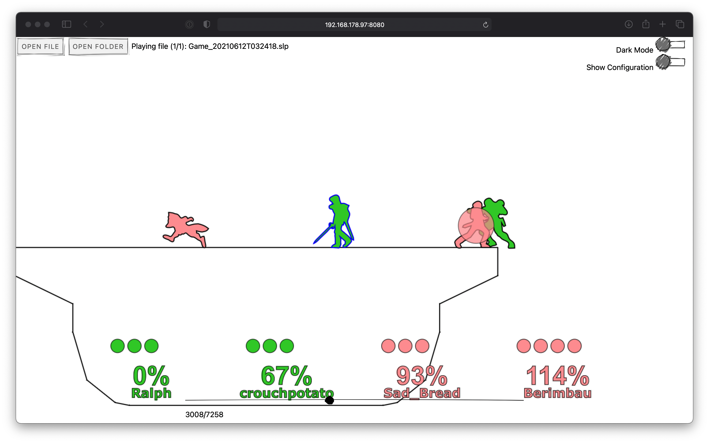

# SlippiLab

Replay your .slp files in the browser. SlippiLab is still in development.
[slippilab.com](https://www.slippilab.com)

Background: https://github.com/project-slippi/project-slippi

## Features

SlippiLab does not re-simulate your match, it reads position and animation data directly from the .slp file. The main advantage of this is that playback is instantaneous from any given starting point whereas Dolphin needs to play through the entire match from the beginning in order to re-compute the game state at the given starting point. This enables a lot of convenience features (rewind, frame advance forwards and backwards) as well as analysis features that require a lot of jumping around (ex: search for a given situation across replays). 

SlippiLab does not upload your replay files anywhere, everything happens on your computer to reduce load times. This means SlippiLab can open huge replay folders quickly (200gb of replays takes about 5 seconds on my laptop).  

## Development

Local development:

> yarn start

Build static site:

> yarn build

## Thanks

The following projects and people are not associated with this project in any way, but served as references or key dependencies and are greatly appreciated.

- [project-slippi](https://github.com/project-slippi)
- [schmooblidon/slippi-visualiser](https://github.com/schmooblidon/slippi-visualiser)
- [vinceau/react-slp-viewer](https://github.com/vinceau/react-slp-viewer)
